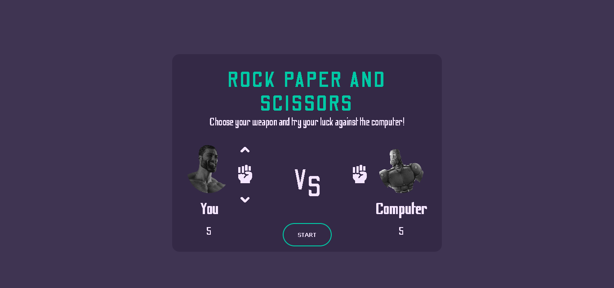

# Rock Paper and Scissors Project

A Javascript Project in The Odin Project

### Preview

### Links

- The Odin Project [https://www.theodinproject.com/](https://www.theodinproject.com/)

- Live Demo: [Website Preview](https://nevz9.github.io/rock-paper-scissors/)

### Built with

- Basic HTML5 and CSS3
- Basic Javascript

#

This is my first project in The Odin Project utilizing javascript. Everything is a bit rushed since I didn't have time, especially the CSS. I will definitely come back to it and make it much cleaner.  

I learned a lot doing this project. I challenged myself to not google or check discord for answers that I'm struggling with. It definitely paid off. It took me some time to get rid of my mindblock and thankfully was able to solve my problems.
Eventhough the javascript code is a bit rough and repetitive :weary: :sob: I still had fun!